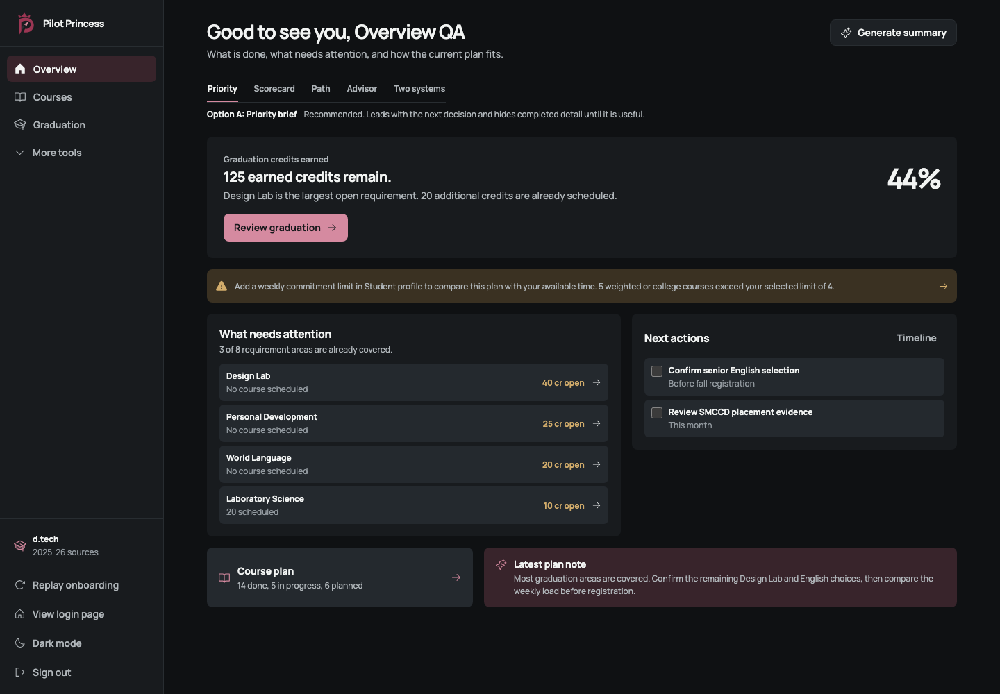
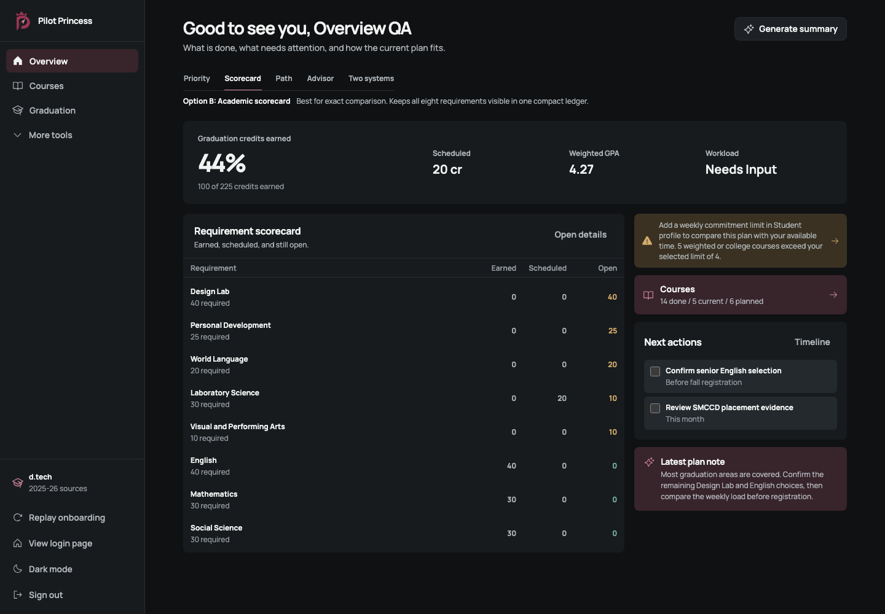
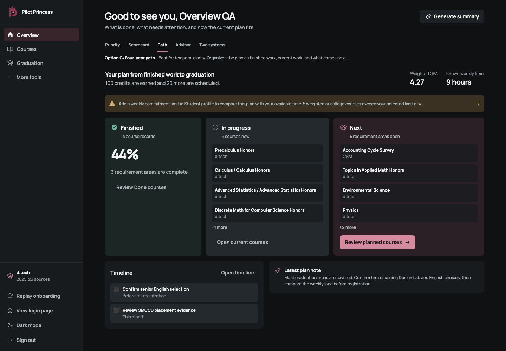
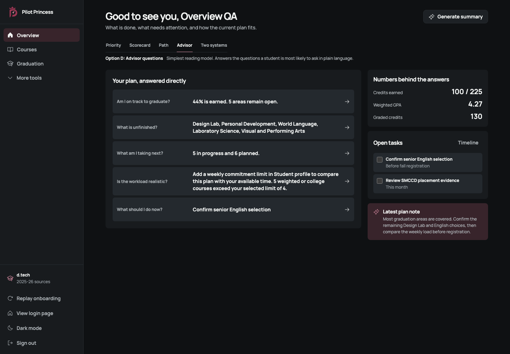
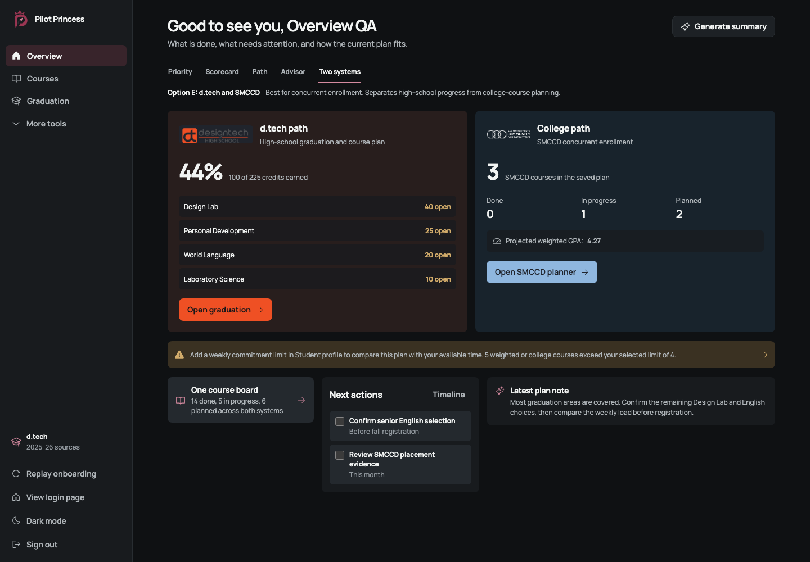
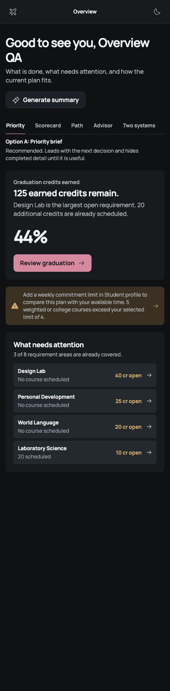
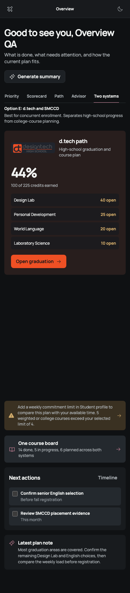

# Overview concept review

Last reviewed: 2026-07-10

The Overview is the student's first decision surface. Five deliberately different compositions are available behind a temporary switcher so the product owner can compare the same live data, not isolated mockups. The switcher carries `data-demo-only="overview-concept-review"` and must be removed after selection.

All concepts use the same deterministic graduation, GPA, workload, plan, task, and provenance data. They differ only in information order and interaction model.

## Recommendation

Start with **Option A: Priority brief**. It best serves a returning student by answering three questions in order:

1. What remains?
2. What needs attention now?
3. Where do I act?

Option E is the strongest alternative if concurrent enrollment should dominate the product story. A useful production composition may combine A's decision order with E's compact source split, but should not retain both complete layouts.

## Option A: Priority brief

- Leads with earned-credit remainder and the largest open requirement.
- Shows only open requirement areas, not all eight.
- Keeps tasks and the course-board destination nearby.
- Best default for low cognitive load.
- Tradeoff: complete areas require opening Graduation.

## Option B: Academic scorecard

- Keeps all requirement areas in one exact earned/scheduled/open ledger.
- Makes GPA, workload, and scheduled credit easy to compare.
- Best for audit and counselor-style review.
- Tradeoff: denser and less directive for a student who only needs the next action.

## Option C: Four-year path

- Organizes the plan as Finished, In progress, and Next.
- Makes course status and temporal movement easiest to understand.
- Best bridge to the Courses kanban.
- Tradeoff: requirement gaps receive less emphasis and the three stages create more bounded surfaces.

## Option D: Advisor questions

- Uses plain-language questions instead of dashboard labels.
- Answers graduation, unfinished work, next courses, workload, and immediate action.
- Best for first-time or less planning-confident students.
- Tradeoff: exact evidence is one click deeper and long answers need careful copy limits.

## Option E: d.tech and SMCCD

- Separates high-school graduation from concurrent-enrollment planning.
- Uses official institution marks, scoped colors, and text provenance.
- Reunifies both paths through one course board and task list.
- Best for the product's dual-enrollment differentiation.
- Tradeoff: students with no SMCCD plan receive a quieter empty college side.

## Responsive evidence

Automated browser capture verified all five at 1,440px with no horizontal overflow. Priority and Two systems also passed at 390px with document width equal to viewport width. Both themes use semantic tokens; reduced-motion behavior comes from the shared React Bits adapters.

## Five review loops

1. **Hierarchy:** removed the old duplicated metric/card stack and made one decision answer primary.
2. **Exact comparison:** added a ledger concept for students who need all requirements at once.
3. **Temporal model:** tested a course-status path aligned to Done/In progress/Planned.
4. **Plain language:** replaced dashboard abstractions with direct student questions.
5. **Provenance and responsiveness:** separated d.tech/SMCCD identity, then checked desktop, 390px, dark, light-token contrast, and overflow.

## Owner decision

Choose the production reading model: **A Priority**, **B Scorecard**, **C Path**, **D Advisor**, or **E Two systems**. After selection:

- remove the review toolbar and four unused compositions;
- keep a single `OverviewConceptData` mapping so calculations do not fork;
- run populated light/dark desktop/mobile QA again; and
- update this document to a short rationale instead of a concept gallery.
