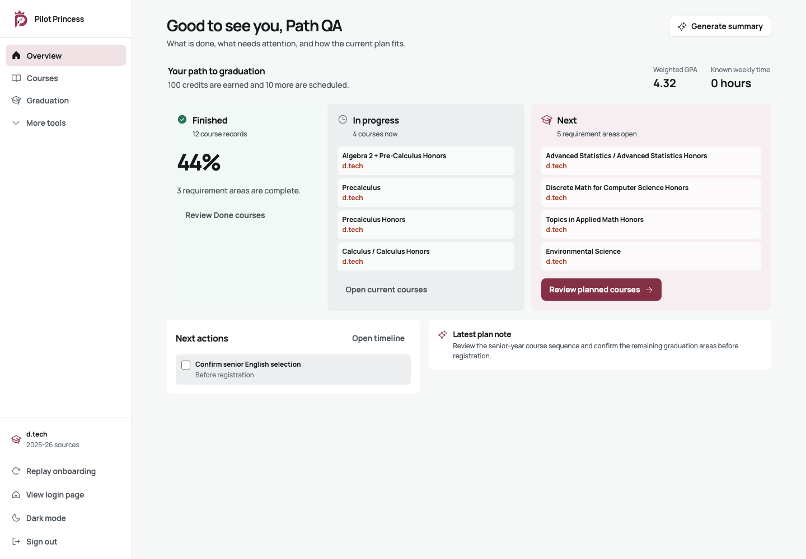

# Production Overview: four-year path

Selected by Jay on 2026-07-10.

The Overview uses a temporal reading model aligned with the Courses kanban:

1. **Finished** shows earned graduation coverage and links to transcript-backed Done courses.
2. **In progress** shows the courses being taken now.
3. **Next** shows planned courses or, when none exist, the largest open graduation requirements.

GPA and known weekly time remain compact context above the path. Missing workload input is an actionable callout. Timeline tasks and the latest generated plan note follow the path without repeating its course counts.

The previous five-concept switcher and unused Priority, Scorecard, Advisor, and Two systems layouts were removed after selection. All calculations still come from the existing deterministic graduation, GPA, workload, task, and course-status engines.

## Institution treatment

Course source labels use scoped institution colors while course names remain in the shared high-contrast text color. d.tech uses its official orange mark without embedding the low-contrast gray wordmark inside a dark patch. CSM, Skyline, Cañada, and SMCCD retain their official marks and scoped colors. Text provenance is always present, so identity never relies on color alone.

## Review gate

- Finished, In progress, and Next remain distinct in copy, position, icon, and surface.
- Earned percentage never includes scheduled courses.
- Planned college courses show their campus source.
- The layout has no horizontal overflow at 390px.
- Light, dark, populated, empty, workload-warning, and reduced-motion states pass before release.
